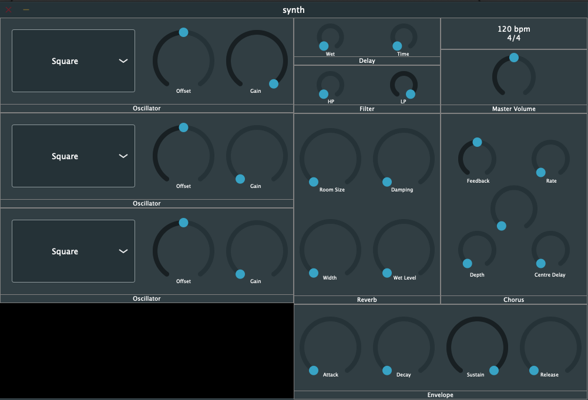

# Isolate

A polyphonic subtractive synthesiser plugin built with JUCE.



## Features:

    - Delay (Synced with DAW)
    - Reverb
    - Filter
    - Chorus
    - Envelope
    - 3 Oscillators

## How to build with Xcode

1. Download [JUCE](https://juce.com/get-juce).
2. Clone repository and open the jucer file.
3. Click `Save and Open in IDE` button.
4. in Xcode chosee Product > Build.
5. The plugin will be built in the repository's `Builds` directory.

## How to install binary (Mac)

Download and copy the file to your plugin components directory `/Library/Audio/Plug-Ins/Components`

You can find the directory following the below instructions.

```
In the Finder choose Go > Go to Folder, enter "/Library/Audio/Plug-Ins/Components" into the Go to Folder field, then click Go.
```

### Last built with JUCE v6.0.5
